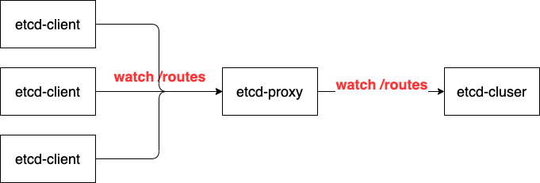

# etcd-proxy

# 这个项目是做什么的？

解决大量etcd client监听etcd时候，导致的etcd负载高，写入慢的问题。

这个服务将会透传etcd的key监听以外的请求，buffer 相同的 etcd监听请求，并将监听请求的结果返回到客户端。

# 背景
业务场景上，我们使用etcd作为配置中心，借助etcd的事件监听功能，做到集群配置可以实时动态更新。

But 数百数千个etcd-client监听一个etcd集群的事件变更时，etcd的性能会急剧下降。
即使只存储几百个key，几k的数据， 每次写数据的延迟都非常高，而且etcd集群常处于overload的状态

# 可行性
etcd在监听一个key且指定modifyIndex时，监听到的事件是固定的。

返回modifyIndex后的第一个事件。

# 解决

已知多数情况下，所有etcdclient监听的key-modifyindex都是相同的，
我们可以将这些 watch 请求，都聚合成一个监听的请求，
当接收到返回时，再由代理服务将变更的时间，返回给所有etcdclient，降低etcd server的负载。

# 原理

每个etcd-client发起请求监听请求到proxy服务时，后有两种情况：
1. 这是第一个发起的监听etcd变更的请求：将该监听的key和index记录到一个map中，并建立与etcd集群的连接，
等待集群返回变更事件。
2. 第2，3个client在监听该key-index的事件变更，proxy不再与etcd建立新的etcd连接，将该请求加入到watcher列表中

当一个etcd事件返回时，通知所有监听该事件的客户端。

# TODO
- [ ] test case
- [ ] benchmark
- [ ] readme in English
- [ ] health check of the etcd endpoints